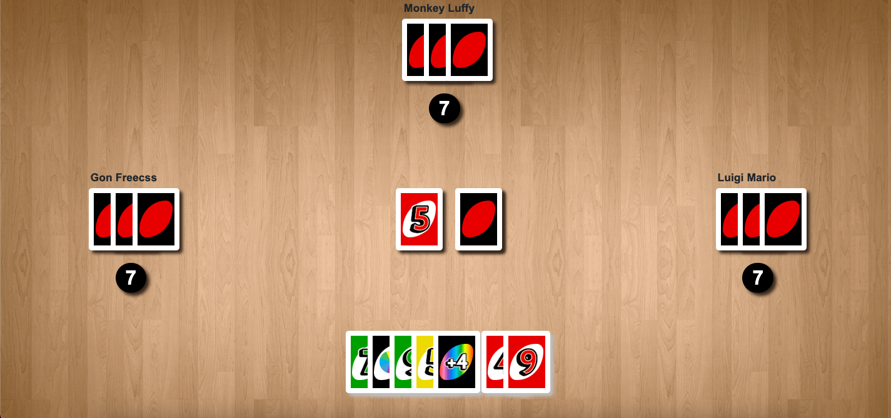

# UNO (Desktop/Widescreen Only)

A re-make of the famous UNO card game.

## Table of Contents

- [Introduction](#introduction)
- [Features](#features)
- [Technologies Used](#technologiesUsed)
- [What I Learned](#whatILearned)
- [Usage](#usage)
- [Contributing](#contributing)
- [Contact Me](#contactMe)

<h2 id="introduction">Introduction</h2>

Growing up, my sister and I would play UNO one-on-one for hours until one of us was too ticked-off to continue. The game is usually most fun with at least 3 players because cards like reverse and skip don't work exactly the same with 2 players. Everyone has their own 'house rules' for the game but I tried to stick as close to the rulebook as I could. UNO rules are simple.

- You can get rid of a card on your turn if it matches either the color or the number of the card on top of the discard pile.
  (Top of discard pile is a Red 1. You can play any red card or any card with the number 1)
- Black cards are wild cards. They can be played regardless of what is on top of the discard pile. Once played, you will get to choose the new color of the discard pile.
- If you do not have any cards that match the top of the discard pile, you can draw one card from the deck. If the card you drew is playable you can put it down but if it is not, your turn is over.
- +2 and +4 cards cannot be stacked. When one is played, the next player is given their extra cards and continues their turn.
- First player to have 0 cards wins!

With my UNO remake, all you need is a device with a big, wide screen (like an iPad or laptop). The cards and people to play the game come ready when you launch my URL. You will be matched against three random opponents (friends of mine who are on-call 24/7). Good luck!

<h2 id="features">Features</h2>

<h2 id="technologiesUsed">Technologies Used</h2>

- HTML
- CSS
- JavaScript
- Bootstrap

<h2 id="whatILearned">What I Learned</h2>

- JavaScript One-Liners: Before starting this project, I was reading an article from freeCodeCamp about small pieces of code that are so common you might use them in every project. These <a href="https://www.freecodecamp.org/news/javascript-one-liners-to-use-in-every-project/">one-liners</a> were so useful I ended up using a few.
- Bootsrap Modals: My familiarity with Bootstrap modals is growing just as the HTML dialog element is getting full browser support. I've loved using modals as it provides a quick way to show the user information and to visually show that the game in the background has stopped until the user finishes interacting with the modals. My love for modals will remain but I believe it is time to get familiar with the HTML dialog element. It seems to be extremely powerful and customizable.
- Improvement 1: A lot of code is repeated. Now that I am aware of what simple functions are used over and over I will be able to group them together when I rebuild this project in the future with a framework.
- Improvement 2: To go along with Improvement 1, I should have used a 'computer player' class instead of creating 3 unique but similar computer objects. In the beginning, I did not think that the individual cpu objects would have much functionality so I decided to create them on their own. As the project grew, I added more functions that were essentially the same to each cpu object. The code still runs fast because this project is small but it is definitely hard to read and hard to maintain.
- Improvement 3: I used a lot of absolute positioning to get the different players and their cards spaced out correctly. I understand now that this is bad practice and would like to eventually change my positioning system. Off the top of my head, a grid system with flexboxes inside for the hands might be a good alternative.
- Improvement 4: This application currently is only supported by larger screens like a full screen computer or a landscaped iPad. I would've liked to make this responsive but my main focus was solely on making the game work. Personally I don't think there is a clear solution to making this work on a portrait phone. I would have to hide a lot of the UI and only show the necessary information like the user's cards and the discard. A possible solution would be to force landscape orientation and make the items on the screen much smaller.
- Imrovement 5: The computers decision making is pretty simple. I would like to make them a little smarter. They pick the first card they find that matches the discard and they do not pick the 'best' color for their given hand when they play a wild card; just a random color.

<h2 id="usage">Usage</h2>

Simply clone the project and open using the index.html file or open the live site with <a href="https://finnjenn.github.io/knowYourTypeV2/">Github Pages</a>

You (the user) get to go first at the start of every new game. Either click a card in your hand to play it or click the deck in the middle to draw a card. Your hand is highlighted and slightly rasises itself when it is back to your turn.

The number under the cpu hand is the current number of cards they have. If they have 1 card left, it will say UNO

<h2 id="contributing">Contributing</h2>

Contributions are welcome! If you'd like to contribute to this project, please follow these steps:

- Fork the repository.
- Create a new branch for your feature or bug fix.
- Make your changes and commit them.
- Push your changes to your forked repository.
- Submit a pull request detailing your changes.

<h2 id="contactMe">Contact Me</h2>

For any questions, suggestions, or feedback, please feel free to contact me:

- Github: <a href="https://github.com/finnjenn">finnjenn</a>
- Email: <a href="mailto:finnjennings00@gmail.com">finnjennings00@gmail.com</a>
